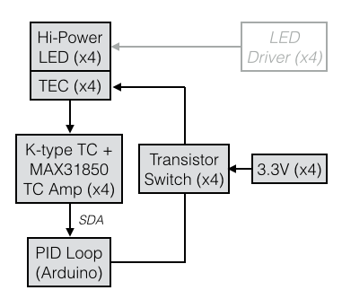

# LEDTempPID
Code for an Arduino-based PID temperature controller for high power LEDs.

This code is designed to control the temperature of 4 high power LEDs mounted on thermoelectric coolers via PID loops.  LED temperatures are measured with a K-type termocouple and [MAX31850 breakouts](http://www.adafruit.com/product/1727).  It requires the [PIDLibrary](http://playground.arduino.cc/Code/PIDLibrary), [OneWire](https://github.com/adafruit/MAX31850_OneWire), and [DallasTemp](https://github.com/adafruit/MAX31850_DallasTemp).

The TECs are connected to Arduino pins 6, 9, 10, and 11.

A general block diagram of the system is below.

